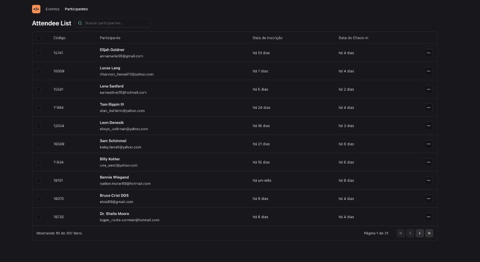

<h1 align="center">Pass-in-web NLW Unite</h1>

Projeto realizado no evento NLW Unite da plataforma Rocketseat

  

✅ Tecnologias

Esse projeto foi desenvolvido com as seguintes tecnologias :
- ReactJS
- TailwindCSS
- Typescript
- HTML
- CSS
- Git e Github
- Figma
- Vite (para tooling)
- API Node.js
- uso de URL States

💻 Projeto

O projeto foi desenvolvido no evento NLW Unite da plataforma Rocketseat. Durante três dias foram construidos o projeto "pass-in" em diversas linguagens, realizei a trilha de ReactJS, onde o objetivo era a realização de um gerenciador de inscrições para eventos, onde é possivel visualizar quem vez check-in, confirmação de inscrição, buscar por nomes e mudar as páginas para ver mais participantes. 